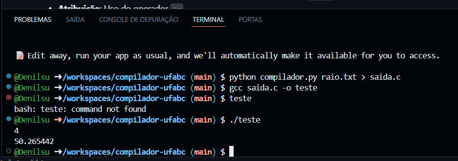

# Compilador UFABCSharp para C

Este repositório contém o código-fonte de um compilador simples desenvolvido para a disciplina de Compiladores. O compilador traduz uma linguagem chamada **UFABCSharp** para a linguagem C.

O projeto foi desenvolvido em **Python** e não utiliza ferramentas externas de geração de analisadores, como ANTLR. Todo o processo de análise léxica, sintática e geração de código foi implementado manualmente.

## Sobre a Linguagem UFABCSharp

UFABCSharp é uma linguagem projetada para realizar cálculos matemáticos simples, com suporte para variáveis, entrada e saída de dados. O objetivo é ser uma ferramenta didática para demonstrar os conceitos fundamentais da construção de compiladores.

### Funcionalidades Principais

* **Declaração Implícita de Variáveis**: Todas as variáveis são do tipo `float` e são declaradas no código C gerado na primeira vez que são utilizadas.
* **Atribuição**: Uso do operador `:=`.
* **Expressões Aritméticas**: Suporte para as quatro operações básicas (`+`, `-`, `*`, `/`).
* **Parênteses**: Uso de `()` para agrupar expressões e alterar a ordem de avaliação.
* **Entrada e Saída**: Comandos `leia` para ler um valor do teclado e `escreva` para imprimir um valor na tela.
* **Números Reais**: Suporte nativo para números inteiros e de floats.

### Gramática da Linguagem

A estrutura sintática da UFABCSharp é definida pela seguinte Gramática Livre de Contexto, já fatorada para eliminar recursão à esquerda:

```bnf
programa   -> comando+

comando    -> atribuicao | leitura | escrita

atribuicao -> ID := expressao;

leitura    -> leia ID;

escrevita  -> escreva expressao;

expressao  -> termo ( (+|-) termo )*

termo      -> fator ( (*|/) fator )*

fator      -> NUMERO_REAL
            | NUMERO_INTEIRO
            | ID
            | ( expressao )
```

## Arquitetura do Compilador

O compilador é construído em três fases principais:

1.  **Analisador Léxico (Lexer)**: O arquivo `compilador.py` contém uma classe `Lexer` que lê o código-fonte como uma string e o divide em uma sequência de *tokens* (números, identificadores, operadores, etc.).

2.  **Analisador Sintático (Parser)**: A classe `Parser` recebe a lista de tokens e verifica se ela segue as regras da gramática. Durante essa verificação, ele constrói uma **Árvore Sintática Abstrata (AST)**, que representa a estrutura hierárquica do programa.

3.  **Gerador de Código**: A classe `CodeGenerator` percorre a AST e, para cada nó, gera o código C equivalente. Ele também gerencia uma tabela de símbolos para declarar todas as variáveis no início da função `main` em C.

## Pré-requisitos

Para executar este compilador e o programa resultante, você precisará de:

* **Python 3.6** ou superior.
* Um compilador C, como o **GCC**.

## Como Usar

Siga os passos abaixo para compilar e executar um programa escrito em UFABCSharp.

### 1. Crie um arquivo-fonte

Crie um arquivo com a extensão de sua preferência (ex: `.txt`) e escreva seu código em UFABCSharp.

**`exemplo.txt`**
```
// Programa para calcular a área de um círculo

leia raio;

pi := 3.14159;

area := pi * (raio * raio);

escreva area;
```

### 2. Execute o Compilador

Use o script Python para traduzir seu arquivo `.txt` para um arquivo `.c`.

```sh
python compilador.py exemplo.txt > saida.c
```
* `compilador.py`: O compilador UFABCSharp.
* `exemplo.txt`: O arquivo de entrada com o código-fonte.
* `> saida.c`: Redireciona a saída do script para criar o arquivo `saida.c`.

### 3. Compile o Código C Gerado

Use o GCC para compilar o arquivo `saida.c` e criar um executável.

```sh
gcc saida.c -o programa
```
* `saida.c`: O código C gerado pelo nosso compilador.
* `-o programa`: Define o nome do arquivo executável final como `programa`.

### 4. Execute o Programa

Agora você pode executar o programa compilado.

```sh
./programa
```
O programa irá parar e esperar que você digite um valor para a variável `raio`. Se você digitar `10` e pressionar Enter, a saída será:
```
314.159000
```

## Exemplo de execução no GitHub Workspaces


## Autor

**DENILSON ARAUJO MARCELINO DA SILVA - RA: 21041115** - denilson.marcelino@aluno.ufabc.edu.br